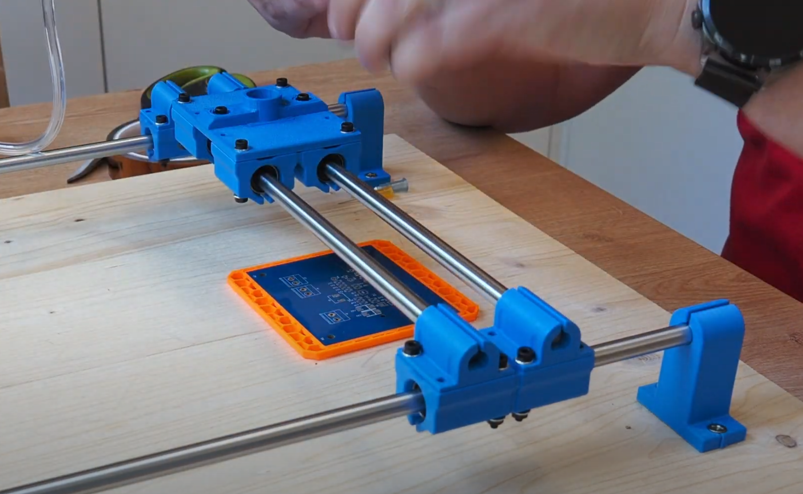

# :warning: WORK IN PROGRESS, not ready yet :warning:

# Pomocník pro umisťování SMD součástek

Video ukázka zde: 

[][https://www.youtube.com/watch?v=LVttwEwAXvI]

Soubory pro 3D tisk: https://www.printables.com/model/1296320-smd-pick-and-place-table

Jednoduchý a levný pomocník pro umisťování SMD součástek na desku plošných spojů. Je čistě manuální, jedinou elektronikou je vzduchové čerpadlo a nožní spínač. 

Důvodem konstrukce byla má nešikovnost: pinzetou sice umístím 1206 nebo 0805 součástku na desku, ale u 0402 už jde přesnost do háje protože se mi třese ruka, podobné je to s QFN. Potřeboval jsem jednak nějakou opěrku ruky, a současně i nástroj který bych ovládal nohou a eliminoval tak nechtěné drbnutí do součástky při uvolňování stisku.

Zdrojáky pro 3D model jsou [zde v Onshape](https://cad.onshape.com/documents/bf77973fe373a59ededb9eb3/w/fd4746b66ac4c9f5be0a092b/e/c65b6b765ea4744c6770720e?renderMode=0&uiState=6824bef04ff0807716bb09a0).

## Komponenty

FIXME TODO

1× nožní spínač, já použil tento: [TFS-201](https://allegro.cz/nabidka/nozni-spinac-tfs-201-s-kabelem-2-m-ovladaci-pedal-17336487157)
:warning: *Měl* by být bezpečný -- kovový plát vespod není nijak propojen s vnitřkem -- ale použijte samozřejmě jakýkoli jiný spínač, pokud se vám na tomto cokoli nepozdává.

1× [akvarijní vzduchovací pumpa Tetra APS 100](https://www.hornbach.cz/p/provzdusnovaci-cerpadlo-tetratec-aps-100/7000956/)

4× [hlazená ocelová tyč ⌀ 8 mm / délka 300 mm](https://dratek.cz/arduino/148609-vodici-tyc-ocelova-chromovana-prumer-8-mm-delka-300-mm.html)

8× [lineární ložiska LM8UU](https://dratek.cz/arduino/7771-linearni-kulickove-lozisko-lm8uu.html)

1× [dávkovací stříkačka](https://www.laskakit.cz/davkovaci-tuba-5cc-s-hadici-a-adapterem/)

1× [sada dávkovacích jehel](https://www.laskakit.cz/en/jehla-pro-davkovaci-tuby--kov--50ks/)

12-24× [šrouby M3x25 s válcovou inbus hlavou](https://www.hornbach.cz/p/sroub-s-valcovou-hlavou-a-vnitrnim-sestihranem-din-912-m3x25-mm-galvanicky-pozinkovany-100-kusu/6834873/)

2× [šrouby M3x10 s válcovou inbus hlavou](https://www.hornbach.cz/p/sroub-s-valcovou-hlavou-a-vnitrnim-sestihranem-din-912-m3x10-mm-galvanicky-pozinkovany-100-kusu/6834896/)

14-26× [matice M3](https://www.hornbach.cz/p/matice-presna-m3-sestihranna-zinek-bily-baleni-50-ks/8718278/)

8× vrut 3, 5x16 se zapuštěnou hlavou

1× nějaká deska na kterou se do celé připevní

## Vzduchovací pumpa

https://www.instructables.com/Vacuum-Pump-from-Aquarium-Air-Pump/

