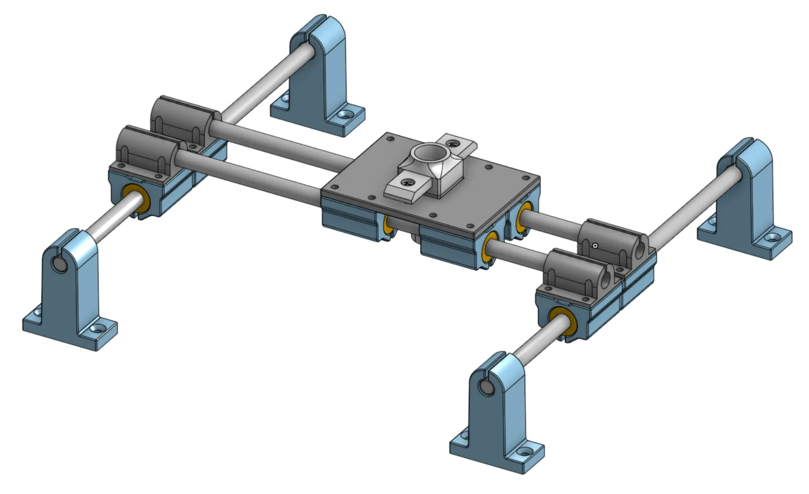

# SMD component placement assistant

Video demo here:

A simple and cheap assistant for placing SMD components on a printed circuit board. It is purely manual, the only electronics are an air pump and a foot switch.

The reason for the design was my inexperience: I can place a 1206 or 0805 component on the board with tweezers, but with 0402, the accuracy is already ruined because my hand shakes. It's similar with QFN. So I needed both a hand rest and a tool that I could control with my foot and thus eliminate unwanted rubbing against the component when releasing it.

Links:
- 3D printable model: https://www.printables.com/model/1296320-smd-pick-and-place-table
- Onshape documentation: https://cad.onshape.com/documents/bf77973fe373a59ededb9eb3/w/fd4746b66ac4c9f5be0a092b/e/c65b6b765ea4744c6770720e?renderMode=0&uiState=6824bef04ff0807716bb09a0

## Components

* 1× foot switch, I used this one: [TFS-201](https://allegro.cz/nabidka/nozni-spinac-tfs-201-s-kabelem-2-m-ovladaci-pedal-17336487157)
:warning: *Should* be safe -- the metal plate underneath is not connected to the inside in any way -- but of course use any other switch if you don't like anything about this one.

* 1× [aquarium air pump Tetra APS 100](https://www.hornbach.cz/p/provzdusnovaci-cerpadlo-tetratec-aps-100/7000956/)

* 4× [smoothed steel rod ⌀ 8 mm / length 300 mm](https://dratek.cz/arduino/148609-vodici-tyc-ocelova-chromovana-prumer-8-mm-delka-300-mm.html)

* 8× [linear bearings LM8UU](https://dratek.cz/arduino/7771-linearni-kulickove-lozisko-lm8uu.html)

* 1× [dosing syringe](https://www.laskakit.cz/davkovaci-tuba-5cc-s-hadici-a-adapterem/)

* 1× [set of dosing needles](https://www.laskakit.cz/en/jehla-pro-davkovaci-tuby--kov--50ks/)

* 12-24× M3x25 screws with cylinder head

* 24-48× 3.5 mm washers

* 2× M3x10 screws with cylinder head

* 14-26× M3 nuts

* 8× 3.5 mm countersunk screw (length as needed, screws are only used to attach everything to the board)

* 1× some board to which the whole thing will be attached

The total price of all components in CZ is approximately 1300 CZK which is around 60 USD`.

## Procedure

### Vacuum pump

In the air pump, you need to turn the diaphragm according to this instruction so that the pump works as a vacuum pump:
https://www.instructables.com/Vacuum-Pump-from-Aquarium-Air-Pump/

### Foot switch
The aforementioned foot switch needs to be connected in series with the pump. I solved this by cutting the supply cord to the pump approximately in half its length, snapping the ferrules onto the ends of the wires, connecting everything via WAGO terminals and hiding it in a box. Roughly like this:

| From Where | Where |
| - | - |
| foot switch, black wire ⬛| (will not be connected, insulate thoroughly!⚠️) |
| foot switch, white wire ⬜| pump, brown wire 🟫|
| supply cord, brown wire 🟫| foot switch, red wire 🟥|
| power cord, blue wire 🟦| pump, blue wire 🟦|

A switch with an integrated socket would be better, but I couldn't find one. If you have any tips, let me know.

### 3D printing

The 3D printing files are [here on Printables](https://www.printables.com/model/1296320-smd-pick-and-place-table). There is also a 3MF file for the Bambulab A1 Mini.

With the exception of the pen holder itself, everything can be printed without supports. Assembly is easy, just insert the bearings into the holders, connect the bearing holders with their counterparts *loosely* with screws and nuts, insert the guide rods, attach everything to the board with screws, test that everything moves as it should, and tighten the screws.

As you can see from the photos, I only used about half of the screws to connect the parts and everything still holds perfectly tight.

Please note that the "double X slide set - Y rod holder.stl" parts are oriented, they have a stop on the side to prevent the rod from slipping out.

The "pen holder adaptor.stl" part is modeled to the size of the specific filling syringe listed in the material list. However, it is possible to re-model it as you wish, [all the sources in Onshape are freely accessible here](https://cad.onshape.com/documents/bf77973fe373a59ededb9eb3/w/fd4746b66ac4c9f5be0a092b/e/c65b6b765ea4744c6770720e?renderMode=0&uiState=6824bef04ff0807716bb09a0).
