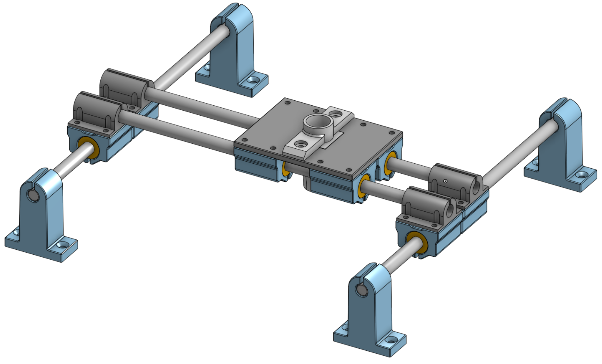

# Pomocník pro umisťování SMD součástek

Video ukázka zde: 

Jednoduchý a levný pomocník pro umisťování SMD součástek na desku plošných spojů. Je čistě manuální, jedinou elektronikou je vzduchové čerpadlo a nožní spínač. 

Důvodem konstrukce byla má nešikovnost: pinzetou sice umístím 1206 nebo 0805 součástku na desku, ale u 0402 už jde přesnost do háje protože se mi třese ruka. Podobné je to i s QFN. Potřeboval jsem tedy jednak nějakou opěrku ruky a současně i nástroj který bych ovládal nohou a eliminoval tak nechtěné drbnutí do součástky při jejím uvolňování.

Odkazy:
 - 3D model pro tisk: https://www.printables.com/model/1296320-smd-pick-and-place-table
 - Podklady v Onshape: https://cad.onshape.com/documents/bf77973fe373a59ededb9eb3/w/fd4746b66ac4c9f5be0a092b/e/c65b6b765ea4744c6770720e?renderMode=0&uiState=6824bef04ff0807716bb09a0

## Komponenty

* 1× nožní spínač, já použil tento: [TFS-201](https://allegro.cz/nabidka/nozni-spinac-tfs-201-s-kabelem-2-m-ovladaci-pedal-17336487157)
:warning: *Měl* by být bezpečný -- kovový plát vespod není nijak propojen s vnitřkem -- ale použijte samozřejmě jakýkoli jiný spínač, pokud se vám na tomhle cokoli nepozdává.

* 1× [akvarijní vzduchovací pumpa Tetra APS 100](https://www.hornbach.cz/p/provzdusnovaci-cerpadlo-tetratec-aps-100/7000956/)

* 4× [hlazená ocelová tyč ⌀ 8 mm / délka 300 mm](https://dratek.cz/arduino/148609-vodici-tyc-ocelova-chromovana-prumer-8-mm-delka-300-mm.html)

* 8× [lineární ložiska LM8UU](https://dratek.cz/arduino/7771-linearni-kulickove-lozisko-lm8uu.html)

* 1× [dávkovací stříkačka](https://www.laskakit.cz/davkovaci-tuba-5cc-s-hadici-a-adapterem/)

* 1× [sada dávkovacích jehel](https://www.laskakit.cz/en/jehla-pro-davkovaci-tuby--kov--50ks/)

* 12-24× [šrouby M3x25 s válcovou inbus hlavou](https://www.hornbach.cz/p/sroub-s-valcovou-hlavou-a-vnitrnim-sestihranem-din-912-m3x25-mm-galvanicky-pozinkovany-100-kusu/6834873/)

* 24-48× [podložky 3,5 mm](https://www.hornbach.cz/p/plocha-podlozka-stredni-o-3-5-mm-baleni-100-ks/8718306/)

* 2× [šrouby M3x10 s válcovou inbus hlavou](https://www.hornbach.cz/p/sroub-s-valcovou-hlavou-a-vnitrnim-sestihranem-din-912-m3x10-mm-galvanicky-pozinkovany-100-kusu/6834896/)

* 14-26× [matice M3](https://www.hornbach.cz/p/matice-presna-m3-sestihranna-zinek-bily-baleni-50-ks/8718278/)

* 8× vrut 3, 5 mm zapuštěnou hlavou (délka dle potřeby, vruty slouží jen k připevnění všeho na desku)

* 1× nějaká deska na kterou se do celé připevní

Celková cena všech komponent (bez poštovného) je zhruba 1300 Kč .

## Postup

### Vakuová pumpa

Ve vzduchovací pumpě je potřeba obrátit membránu podle tohoto návodu, aby pumpa fungovala jako vakuová:
https://www.instructables.com/Vacuum-Pump-from-Aquarium-Air-Pump/

### Nožní spínač
Uvedený nožní spínač je potřeba zapojit do série s pumpou. Já to vyřešil přestřihnutím přívodní šňůry k pumpě přibližně v polovině délky, nacvaknutím dutinek na konce drátů, propojením všeho přes WAGO svorky a schováním do krabičky. Zhruba takhle:

| Odkud | Kam |
| - | - |
| nožní spínač, černý drát ⬛| (nebude zapojeno -- důkladně zaizolovat!⚠️) |
| nožní spínač, bílý drát ⬜| pumpa, hnědý drát 🟫|
| přívodní šňůra, hnědý drát 🟫| nožní spínač, červený drát 🟥|
| přívodní šňůra,  modrý drát 🟦| pumpa, modrý drát 🟦|

Lepší by byl spínač s integrovanou zásuvkou, ale takový jsem nenašel. Pokud máte nějaký tip, dejte vědět.

### 3D tisk

Soubory pro 3D tisk jsou [zde na Printables](https://www.printables.com/model/1296320-smd-pick-and-place-table). Je tam i 3MF soubor pro Bambulab A1 Mini. 

S výjimkou samotného držáku pera se dá vše tisknout bez podpor. Zkompletování je snadné, stačí zasunout ložiska do držáků, šrouby a matkami spojit *volně* držáky ložisek s jejich protikusy, nasunout vodící tyče, připevnit vše vruty na desku, odzkoušet že se vše pohybuje jak má, a dotáhnout šrouby.

Já jsem, jak vidno z fotek, použil jen cca polovinu šroubů ke spojení dílů a vše i tak drží naprosto pevně.

Pozor, díly "double X slide set - Y rod holder.stl" jsou orientované, na straně mají zarážku proti vyklouznutí tyče. 

Díl "pen holder adaptor.stl" je vymodelovaný na míru té konkrétní plnící stříkačce uvedené v seznamu materiálu. Je možné si jej ale libovolně přemodelovat, podklady v Onshape jsou [volně přístupné](https://cad.onshape.com/documents/bf77973fe373a59ededb9eb3/w/fd4746b66ac4c9f5be0a092b/e/c65b6b765ea4744c6770720e?renderMode=0&uiState=6824bef04ff0807716bb09a0).
